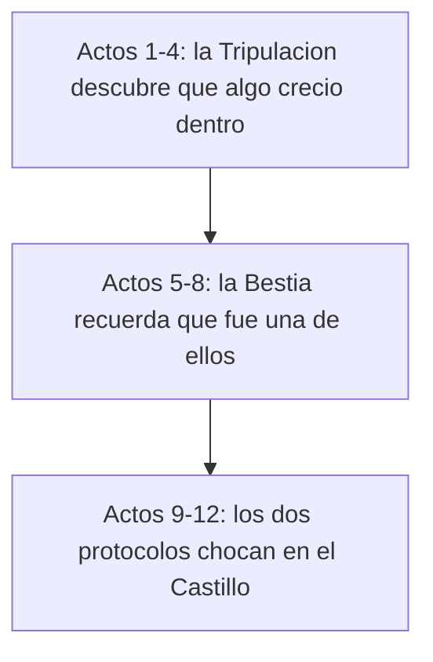

# CHADRINE — Biblia de marca y narrativa

Complementa [GDD.md](GDD.md): allí están las reglas, aquí quién es quién, cómo
suena el juego y qué se puede decir en su nombre.

---

## 1. La promesa

> **Uno contra todos, dentro del navegador.**

Un clic y estás en el hangar. Cuatro Robots contra una Bestia, tres minutos,
sin cuenta ni descarga. Es la promesa entera y ninguna decisión debería
contradecirla.

Esa frase es el pitch para hablar del juego. La cadena que se publica en tiendas
y créditos es `GameBrand.TAGLINE` (hoy «Hangar · Online asimétrico · Campaña») y
solo se cambia ahí, nunca copiándola a otro sitio.

## 2. Tono

**Arcade competitivo.** Neón, metal y velocidad. El jugador entra a *competir*,
no a asustarse: el peligro es que te ganen, no que te sorprendan en la oscuridad.

| Sí | No |
| --- | --- |
| Tensión de partida corta | Terror, jumpscares, gore |
| Humor seco y breve | Chistes largos o memes |
| Bestia imponente y elegante | Bestia grotesca |
| Textos de 3–6 palabras | Párrafos en el HUD |
| Neón cian / carmesí | Paletas apagadas o realistas |

## 3. Mundo

**El Hangar Chadrine** es una estación industrial de reciclaje orbital: pasillos
modulares, contenedores, reactores y puentes al vacío. Todo está construido para
máquinas, no para gente; no hay humanos en pantalla en ningún momento.

**Los Robots (la Tripulación).** Unidades de mantenimiento con personalidad
propia. No son soldados: son operarios que se han quedado a defender su turno de
trabajo. Sabotean los núcleos porque apagar el hangar es la única forma de
detener lo que está dentro.

**La Bestia.** Una unidad de carga que se sobrecargó y siguió creciendo. No es un
monstruo venido de fuera: es de casa, y eso es lo incómodo. Tres formas conocidas:

- **Clásica** — la original. Garras y fuego. Directa.
- **Mecha** — se blindó con chatarra del hangar. Lenta, imparable, área.
- **Sombra** — aprendió a no ser vista. Camuflaje y vacío.

## 4. Personajes

Cada robot del roster tiene nombre, color e identidad; el catálogo vive en
[autoload/character_catalog.gd](../autoload/character_catalog.gd) y
[tests/cases/identity_test.gd](../tests/cases/identity_test.gd) exige que ninguno
se quede sin nombre legible ni color.

Regla de diseño: **el color es el nombre**. En partida nadie lee etiquetas; se
reconoce al compañero por su silueta y su color. Ningún robot nuevo puede
repetir el color de otro que ya esté en el roster jugable.

## 5. Campaña: las dos caras

La campaña de 12 niveles debe contarse **desde los dos lados**: la Tripulación
descubriendo qué crece en el hangar, y la Bestia recordando que fue una de ellas.

> **Estado real (1.4.0):** los 12 niveles se juegan como Tripulación.
> `ProgressionManager.CAMPAIGN` no tiene campo de rol, así que la doble cara es
> **objetivo, no hecho**. El paso concreto para conseguirla es añadir `"role"` a
> cada entrada de `CAMPAIGN` y que el arranque de campaña lo respete al asignar
> rol en lugar de forzar explorador. Hasta entonces, los actos de abajo son el
> marco narrativo de los `tip` y las pantallas de resultado.

- **Acto I · Primer turno** (niveles 1–4, *Primer Hangar* a *Neon Pressure*).
  Aprendes a sabotear y a huir. El hangar todavía parece un sitio de trabajo.
- **Acto II · Lo que crece** (5–8, *Pozo Reactor* a *Bosque*). La Bestia toma
  territorio: los pasillos que conocías dejan de ser tuyos.
- **Acto III · Protocolo final** (9–12, *Laberinto* a *Protocolo Final*). Reloj
  corto, núcleos de más y la revelación: apagar el hangar apaga también a la
  Bestia, que sigue siendo parte del inventario.

El texto narrativo se entrega en los `tip` de cada nivel de
`ProgressionManager.CAMPAIGN` (una línea, siempre útil además de narrativa) y en
la pantalla de resultado. No hay cinemáticas obligatorias.

## 6. Voz de la interfaz

- **Español neutro**, mayúsculas para etiquetas de sistema (`HANGAR`, `TEATRO`,
  `LISTO`), minúsculas para lo demás.
- Imperativo corto y en segunda persona: «Sabotea el núcleo», no «El jugador
  debe sabotear».
- Los estados dicen qué hacer, no qué pasó: `BLOQUEADO · desbloquéalo jugando
  online` en vez de `Error: contenido no disponible`.
- Vocabulario fijo (no sinónimos): **núcleo** (nunca objetivo), **teatro**
  (nunca mapa en UI), **arsenal** (nunca loadout), **tripulación** (nunca
  equipo), **Bestia** con mayúscula siempre.

## 7. Marca

Todo lo publicable sale de [autoload/game_brand.gd](../autoload/game_brand.gd):
título, tagline, publisher, package id, URLs y disclaimer. Nada de duplicar esas
cadenas en la landing, en las tiendas o en los créditos.

El disclaimer no es opcional: CHADRINE usa siluetas cápsula, una forma
reconocible, y el texto que nos separa de un clon tiene que viajar con el
producto. `identity_test` falla si se acorta.

## 8. Assets

Solo material **CC0 / libre** (Kenney, KayKit) más arte propio; el inventario y
las atribuciones están en [assets/CREDITS.md](../assets/CREDITS.md). Cualquier
asset nuevo entra con su licencia anotada en el mismo commit.

Coherencia visual antes que cantidad: es preferible un roster de ocho robots que
parezcan del mismo juego que veinte de packs distintos que no combinan.
