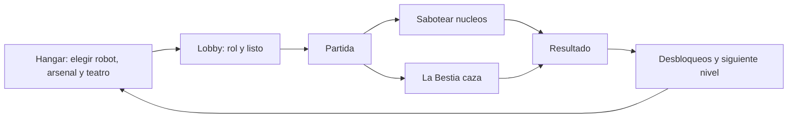

# CHADRINE — Documento de diseño

Versión del documento: sigue a `GameBrand.VERSION` (hoy **1.4.0**).
Fuente única de verdad de la versión: [autoload/game_brand.gd](../autoload/game_brand.gd).
`project.godot` debe coincidir; lo verifica [tests/cases/identity_test.gd](../tests/cases/identity_test.gd).

---

## 1. Qué es

Multijugador asimétrico 3D: **una Bestia contra hasta cuatro Robots**. Los Robots
tienen que sabotear los núcleos del hangar antes de que se acabe el reloj; la
Bestia tiene que agotar sus vidas. Corre en el navegador (WebGL) y contra un
servidor Linux dedicado, con campaña y práctica offline para jugar solo.

**Tono: arcade competitivo.** Legibilidad y ritmo por encima de simulación o
terror. Partidas de 2 a 4 minutos, lectura instantánea de quién es quién, y
feedback inmediato en cada golpe. No es un juego de sigilo ni de sustos.

## 2. Pilares de diseño

1. **Se entiende de un vistazo.** Rol, vidas, núcleos restantes y reloj siempre
   visibles. La Bestia es roja y grande; los Robots son de colores saturados.
2. **Asimetría honesta.** La Bestia gana por presión y control de espacio; los
   Robots por coordinación y economía de tiempo. Ninguno gana solo disparando.
3. **Web primero.** Si algo no corre a 60 fps en un móvil de gama media dentro
   del navegador, no entra. Ver §7.
4. **Nada de fricción de entrada.** Sin cuenta, sin descarga, sin tutorial
   obligatorio. Un clic y estás en el hangar.

## 3. Bucle central

Minuto a minuto (Robots): buscar núcleo → mantener pulsado para sabotear →
romper contacto cuando aparece la Bestia → volver. Minuto a minuto (Bestia):
cortar rutas → forzar peleas en pasillos → castigar al que sabotea solo.

## 4. Reglas de partida

| Regla | Valor | Dónde vive |
| --- | --- | --- |
| Jugadores por partida | 5 (1 Bestia + 4 Robots) | `NetworkManager.MAX_PLAYERS_DEFAULT` |
| Bestias por partida | exactamente 1 | `NetworkManager.has_exactly_one_beast()` |
| Vidas por Robot | 2 | `GameManager.EXPLORER_LIVES` |
| Núcleos a sabotear | 5 (3–7 en campaña) | `GameManager.OBJECTIVES_TO_WIN` |
| Reloj | 95–240 s según nivel | `ProgressionManager.CAMPAIGN` |
| Victoria Robots | núcleos a 0 | `GameManager.register_objective_destroyed()` |
| Victoria Bestia | todos los Robots sin vidas, o reloj a 0 | `GameManager._check_beast_victory()` |

Cubierto por [tests/cases/victory_test.gd](../tests/cases/victory_test.gd).

## 5. Roles y kit

**Robots** — 4 arsenales: Asalto (bláster/railgun a distancia), Escopetero
(daño cercano), Demolición (granadas y plasma en área), Soporte (hielo y
curación). Habilidades comunes: Dash, Escudo, EMP, Turbo.

**Bestia** — 3 variantes: Clásica (garras y fuego), Mecha (slam y púas), Sombra
(orbe de vacío y camuflaje). Habilidades: Dash, Salto, Furia, Camuflaje, Mina.

Cada arsenal y cada bestia tiene exactamente 4 armas y 4 habilidades; el
contrato lo verifica [tests/cases/weapons_test.gd](../tests/cases/weapons_test.gd).

## 6. Progresión

12 niveles de campaña con reloj decreciente y Bestia cada vez más dura. Las
recompensas son **arsenales y variantes de Bestia**, no mapas.

> **Decisión (1.4.0): todos los teatros están siempre abiertos.**
> `unlocked_maps` no cerraba nada en la práctica (`_normalize()` la rellenaba
> entera en cada arranque) mientras `_unlock_rewards()` seguía "desbloqueando"
> mapas que ya estaban. Esconder escenarios en un juego de sesiones cortas solo
> añade fricción, así que `is_map_unlocked()` ahora responde contra
> `NetworkManager.MAP_IDS` y la progresión vive en niveles, arsenales y bestias.
> El campo `unlocked_maps` sigue en el save por compatibilidad con partidas de
> 1.3.x; ya no es una puerta.

El guardado lleva `schema_version` y respaldo del último save bueno
([autoload/progression_manager.gd](../autoload/progression_manager.gd)), porque
una recarga del navegador a mitad de escritura dejaba el progreso ilegible.

## 7. Presupuesto técnico (Web)

Renderer fijo: **GL Compatibility** en escritorio, móvil y web. Es el precio de
llegar a cualquier dispositivo sin descargas, y condiciona todo lo visual: sin
sombras suaves, sin GI, sin post-procesado caro.

| Presupuesto | Objetivo | Cómo se vigila |
| --- | --- | --- |
| Frame | 60 fps móvil gama media | overlay F3, campo "peor" |
| Proyectiles vivos | ≤ 36 en web, ≤ 64 escritorio | `FxPool.MAX_PROJECTILES` |
| Destellos vivos | ≤ 40 en web, ≤ 72 escritorio | `FxPool.MAX_ONESHOTS` |
| Sync de posición | 15 Hz, unreliable ordered | `PlayerBase.SYNC_HZ` |
| Refresco de HUD | 10 Hz | `CombatKit.HUD_REFRESH_HZ` |
| WAV sintetizados vivos | ≤ 64, reutilizados | `AudioDirector.MAX_CACHED_STREAMS` |

**Audio:** todo el sonido se sintetiza en tiempo de ejecución (sin assets). Los
WAV se hornean una vez y se reutilizan; sintetizar por disparo costaba unos
cientos de iteraciones GDScript por bip y un recurso nuevo cada vez.

**Reglas duras de FX:** materiales y mallas se comparten vía
[FxAssets](../scripts/fx/fx_assets.gd); los efectos se apagan escalando a cero,
no bajando alfa (la transparencia paga ordenación por profundidad en WebGL); y
ningún efecto crea nodos nuevos en caliente: los entrega
[FxPool](../autoload/fx_pool.gd).

## 8. Cámara y controles

En táctil y web la cámara es **lateral fija**: el stick mueve, la cámara
acompaña de costado. Se eligió sobre la cámara libre en primera persona porque
apuntar con dos dedos en un móvil era el mayor problema de jugabilidad. En
escritorio con ratón se mantiene el control libre.

## 9. Calidad

- `./scripts/run_tests.sh` — suite headless, ~0,3 s, 8 suites.
- `compile_all` compila todos los scripts del núcleo. Está ahí porque un
  `var idx := abs(peer_id) % n` (que devuelve Variant y no infiere) tumbó
  `player_base.gd` y con él el combate entero sin que nada avisara.
- El deploy no se declara bueno hasta que pasa el smoke (landing, wasm, pck,
  `version.json`, WebSocket, presence); si falla, `deploy.sh` revierte solo a la
  imagen `:previous`.

## 10. Fuera de alcance por ahora

Ranked y matchmaking, chat de voz, cosméticos de pago, mapas generados por
jugadores, y cualquier cosa que exija Forward+ o descarga nativa obligatoria.
Los submodos (platformer, FPS, city builder) son contenido lateral heredado de
packs Kenney: se mantienen compilando, no reciben diseño nuevo.
