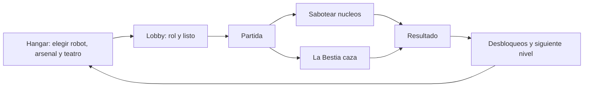

# CHADRINE — Documento de diseño

Versión del documento: sigue a `GameBrand.VERSION` (hoy **1.5.0**).
Fuente única de verdad de la versión: [autoload/game_brand.gd](../autoload/game_brand.gd).
`project.godot` debe coincidir; lo verifica [tests/cases/identity_test.gd](../tests/cases/identity_test.gd).

---

## 1. Qué es

Multijugador asimétrico 3D: **una Bestia contra hasta cuatro Robots**. Los Robots
tienen que sabotear los núcleos del hangar antes de que se acabe el reloj; la
Bestia tiene que agotar sus vidas. Corre en el navegador (WebGL) y contra un
servidor Linux dedicado, con campaña y práctica offline para jugar solo.

**Tono: arcade competitivo.** Legibilidad y ritmo por encima de simulación o
terror. Partidas de 2 a 4 minutos, lectura instantánea de quién es quién, y
feedback inmediato en cada golpe. No es un juego de sigilo ni de sustos.

## 2. Pilares de diseño

1. **Se entiende de un vistazo.** Rol, vidas, núcleos restantes y reloj siempre
   visibles. La Bestia es roja y grande; los Robots son de colores saturados.
2. **Asimetría honesta.** La Bestia gana por presión y control de espacio; los
   Robots por coordinación y economía de tiempo. Ninguno gana solo disparando.
3. **Web primero.** Si algo no corre a 60 fps en un móvil de gama media dentro
   del navegador, no entra. Ver §7.
4. **Nada de fricción de entrada.** Sin cuenta, sin descarga, sin tutorial
   obligatorio. Un clic y estás en el hangar. Las reglas se explican una vez en
   un panel que se cierra ([HowToPlay](../scripts/ui/how_to_play.gd)), no en una
   secuencia guiada: antes lo único que recibía un jugador nuevo era un aviso de
   seis segundos ya dentro del mapa.
5. **Nunca dejar al jugador sin partida.** Si no hay nadie conectado, el camino
   a jugar contra bots tiene que estar a un botón de distancia, también desde
   dentro del lobby vacío.

## 3. Bucle central

Minuto a minuto (Robots): buscar núcleo → mantener pulsado para sabotear →
romper contacto cuando aparece la Bestia → volver. Minuto a minuto (Bestia):
cortar rutas → forzar peleas en pasillos → castigar al que sabotea solo.

> **Regla (1.4.0): recibir daño interrumpe el sabotaje.**
> Antes no lo hacía, y eso vaciaba el rol de la Bestia: un Robot podía canalizar
> tranquilamente con la Bestia disparándole encima y solo perdía el núcleo si
> moría. Interrumpir es lo que convierte la presión en una herramienta.

## 4. Reglas de partida

| Regla | Valor | Dónde vive |
| --- | --- | --- |
| Jugadores por partida | 5 (1 Bestia + 4 Robots) | `NetworkManager.MAX_PLAYERS_DEFAULT` |
| Tripulación en práctica | 4 (3 en web) | `NetworkManager._practice_crew_size()` |
| Bestias por partida | exactamente 1 | `NetworkManager.has_exactly_one_beast()` |
| Vidas por Robot | 2 | `GameManager.EXPLORER_LIVES` |
| Núcleos a sabotear | 5 (3–7 en campaña) | `GameManager.OBJECTIVES_TO_WIN` |
| Reloj | 95–240 s según nivel | `ProgressionManager.CAMPAIGN` |
| Victoria Robots | núcleos a 0 | `GameManager.register_objective_destroyed()` |
| Victoria Bestia | todos los Robots sin vidas, o reloj a 0 | `GameManager._check_beast_victory()` |

Cubierto por [tests/cases/victory_test.gd](../tests/cases/victory_test.gd).

### Variantes de núcleo (mecánicas, no cosmética)

| Kind | Nombre | Regla |
| --- | --- | --- |
| `STANDARD` | Estándar | Mantén pulsado para canalizar |
| `SHIELDED` | Blindado | Rompe el escudo a tiros (`SHIELD_HP`) y luego canaliza |
| `TIMED_RELAY` | Relé | Solo en ventanas abiertas (ciclo open/closed en servidor) |
| `OVERCHARGED` | Sobrecarga | Al caer detona y daña a quien esté cerca |

Lab Neon asigna las cuatro en rotación (`ObjectiveVariants.for_map`) para que
la primera partida las enseñe. El servidor es quien acepta el `sabotage()` final
vía `BeastObjective.can_accept_sabotage()`. Cubierto por
[tests/cases/objective_variants_test.gd](../tests/cases/objective_variants_test.gd).

**Cada teatro debe ofrecer al menos tantas posiciones de núcleo como pida el
nivel más exigente que se juegue en él.** No es un detalle: skybridge salió con
dos de sus seis núcleos en lo alto de unas torres a 4,6 m sobre el puente más
cercano, con el salto dando 1,5 m, así que el nivel 10 era imposible de ganar.
Ahora [tests/cases/maps_test.gd](../tests/cases/maps_test.gd) construye los ocho
mapas y recorre las superficies pisables desde los spawns para comprobar que
todo núcleo tenga suelo desde el que alcanzarlo.

## 5. Roles y kit

**Robots** — 4 arsenales: Asalto (bláster/railgun a distancia), Escopetero
(daño cercano), Demolición (granadas y plasma en área), Soporte (hielo y
curación). Habilidades comunes: Dash, Escudo, EMP, Turbo.

**Bestia** — 3 variantes: Clásica (garras y fuego), Mecha (slam y púas), Sombra
(orbe de vacío y camuflaje). Habilidades: Dash, Salto, Furia, Camuflaje, Mina.

Cada arsenal y cada bestia tiene exactamente 4 armas y 4 habilidades; el
contrato lo verifica [tests/cases/weapons_test.gd](../tests/cases/weapons_test.gd).

## 6. Progresión

12 niveles de campaña con reloj decreciente y Bestia cada vez más dura. Las
recompensas son **arsenales y variantes de Bestia**, no mapas.

> **Decisión (1.4.0): todos los teatros están siempre abiertos.**
> `unlocked_maps` no cerraba nada en la práctica (`_normalize()` la rellenaba
> entera en cada arranque) mientras `_unlock_rewards()` seguía "desbloqueando"
> mapas que ya estaban. Esconder escenarios en un juego de sesiones cortas solo
> añade fricción, así que `is_map_unlocked()` ahora responde contra
> `NetworkManager.MAP_IDS` y la progresión vive en niveles, arsenales y bestias.
> El campo `unlocked_maps` sigue en el save por compatibilidad con partidas de
> 1.3.x; ya no es una puerta.

El guardado lleva `schema_version` y respaldo del último save bueno
([autoload/progression_manager.gd](../autoload/progression_manager.gd)), porque
una recarga del navegador a mitad de escritura dejaba el progreso ilegible.

## 7. Presupuesto técnico (Web)

**Renderer:** `gl_compatibility` (web/móvil). **Física 3D:** Jolt Physics
(Godot 4.6). Los CharacterBody3D / proyectiles usan la misma API; Jolt mejora
estabilidad, CCD y rendimiento en navegador (WASM SIMD).

| Presupuesto | Objetivo | Cómo se vigila |
| --- | --- | --- |
| Frame | 60 fps móvil gama media | overlay F3, campo "peor" |
| Proyectiles vivos | ≤ 36 en web, ≤ 64 escritorio | `FxPool.MAX_PROJECTILES` |
| Destellos vivos | ≤ 40 en web, ≤ 72 escritorio | `FxPool.MAX_ONESHOTS` |
| Sync de posición | 15 Hz, unreliable ordered | `PlayerBase.SYNC_HZ` |
| Refresco de HUD | 10 Hz | `CombatKit.HUD_REFRESH_HZ` |
| WAV sintetizados vivos | ≤ 64, reutilizados | `AudioDirector.MAX_CACHED_STREAMS` |

**Audio:** muestras OGG en `assets/audio/` (SFX + ambience) con
fallback sintético si falta el archivo. Los WAV procedurales se cachean
(`AudioDirector.MAX_CACHED_STREAMS`) para no regenerar por disparo.

**Reglas duras de FX:** materiales y mallas se comparten vía
[FxAssets](../scripts/fx/fx_assets.gd); los efectos se apagan escalando a cero,
no bajando alfa (la transparencia paga ordenación por profundidad en WebGL); y
ningún efecto crea nodos nuevos en caliente: los entrega
[FxPool](../autoload/fx_pool.gd).

## 8. Cámara y controles

En táctil y web la cámara es **lateral fija**: el stick mueve, la cámara
acompaña de costado. Se eligió sobre la cámara libre en primera persona porque
apuntar con dos dedos en un móvil era el mayor problema de jugabilidad. En
escritorio con ratón se mantiene el control libre.

Esa cámara trae un problema propio: se dispara hacia donde encara el cuerpo, y
al cuerpo lo gira el mismo stick que sirve para moverse, sin eje vertical. Por
eso hay **imán de puntería** ([AimAssist](../scripts/combat/aim_assist.gd)) con
cono de 20°, alcance de 28 m y línea de visión obligatoria: corrige el error
fino que un stick no deja afinar y permite alcanzar a alguien que esté en otra
altura, pero fuera del cono no hace nada. No lo reciben ni los bots ni el ratón
en escritorio.

Por el mismo motivo **no hay retícula en el centro de la pantalla**: en cámara
lateral el disparo no sale del centro, así que una mira fija mentiría. La marca
de impacto que aparece al acertar es confirmación, no puntería.

## 9. Calidad

- `./scripts/run_tests.sh` — suite headless, ~0,3 s, **20 suites** (~1200+ checks).
- `compile_all` compila todos los scripts del núcleo. Está ahí porque un
  `var idx := abs(peer_id) % n` (que devuelve Variant y no infiere) tumbó
  `player_base.gd` y con él el combate entero sin que nada avisara.
- El deploy no se declara bueno hasta que pasa el smoke (landing, wasm, pck,
  `version.json`, WebSocket, presence); si falla, `deploy.sh` revierte solo a la
  imagen `:previous`.

## 10. Fuera de alcance por ahora

Ranked y matchmaking, chat de voz, cosméticos de pago, mapas generados por
jugadores, y cualquier cosa que exija Forward+ o descarga nativa obligatoria.
Los submodos (platformer, FPS, city builder) son contenido lateral heredado de
packs Kenney: se mantienen compilando, no reciben diseño nuevo.
